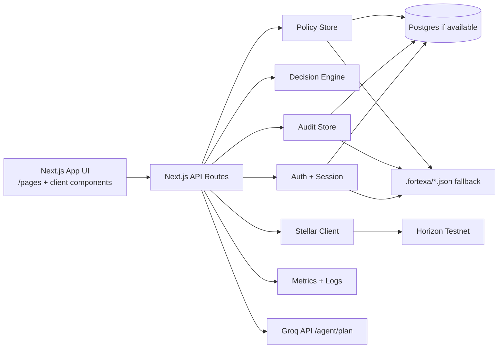
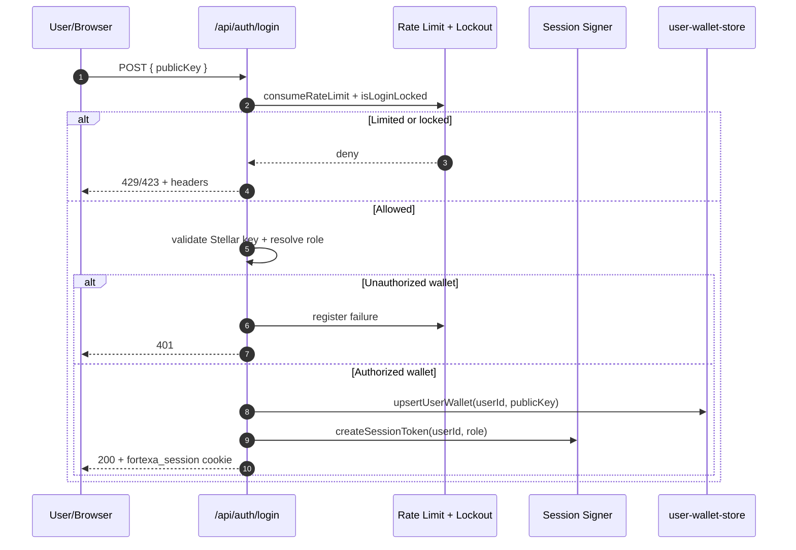
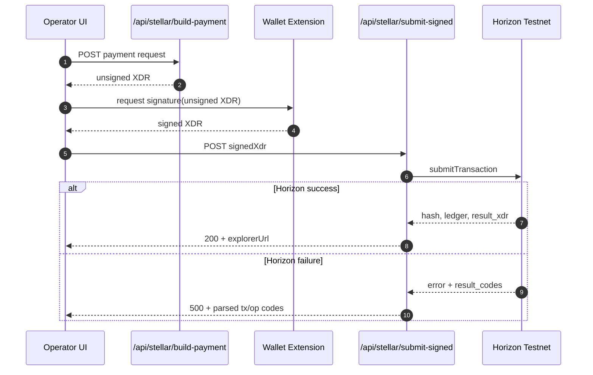
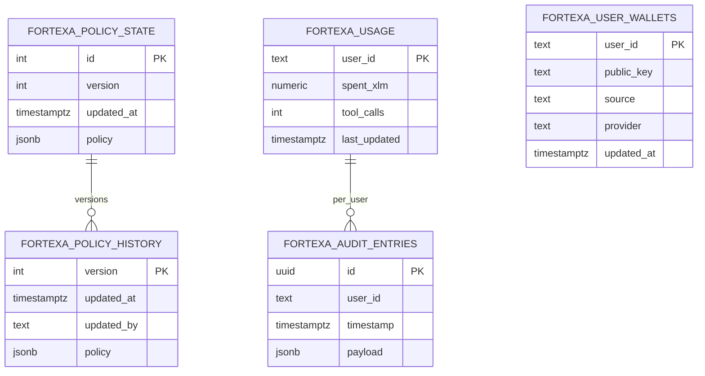
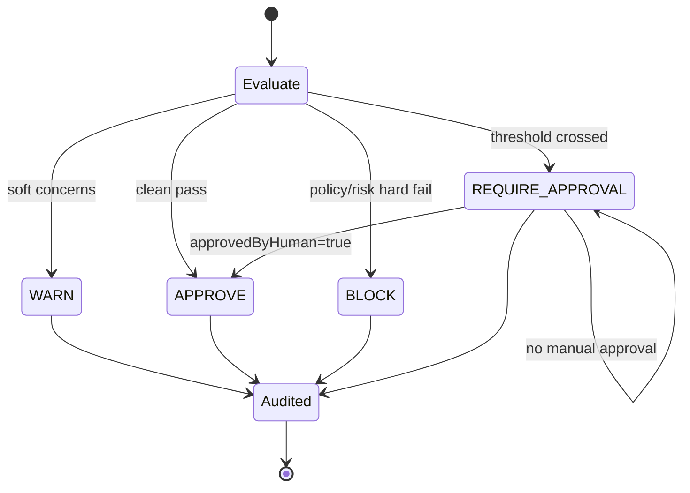

# 🏗️ Fortexa Architecture

> This document describes the architecture **as currently implemented in this repository**, not an idealized target state.
> This file is intended for technical reviewers; see `README.md` for product framing and demo-first flow.

## 1) 🎯 System Purpose

Fortexa is a policy-controlled payment firewall for agent-triggered actions on Stellar.  
It inserts a decision layer between agent intent and transaction submission.

Core intent:
- authenticate users via wallet-bound session
- evaluate requested actions against policy + risk heuristics
- allow signed XDR submission only through authenticated operator flows
- preserve audit evidence for traceability

## 2) 📌 Scope and Non-Goals (Current)

### In scope
- Wallet-address-based login via public-key allowlists (`/api/auth/login`)
- Role-based route protection (`operator`, `viewer`)
- Policy + security-based decisioning
- Signed XDR submission to Stellar Testnet
- Audit/history persistence with DB-first fallback
- Basic health/metrics endpoints for ops visibility

### Explicit non-goals (current code)
- Server-side signing
- Private-key custody
- Mainnet-first transaction flow
- Distributed, strongly consistent security state by default

## 3) 🧭 High-Level Topology

### 3.1 Runtime Container View



### 3.2 Trust Boundary View

```mermaid
flowchart TB
  subgraph Untrusted[Untrusted Zone]
    Browser[Browser + User Input]
    WalletExt[Wallet Extension\n(Freighter etc.)]
  end

  subgraph AppBoundary[Fortexa Application Boundary]
    WebUI[Next.js UI]
    ApiRoutes[API Routes + Validation]
    Authz[Session + Role Authorization]
    Decisioning[Policy + Risk Decisioning]
    Storage[DB/File Persistence]
    Observability[Metrics + Logs]
  end

  subgraph External[External Systems]
    Horizon[Stellar Horizon Testnet]
    Groq[Groq API]
  end

  Browser --> WebUI
  WebUI --> ApiRoutes
  ApiRoutes --> Authz
  ApiRoutes --> Decisioning
  ApiRoutes --> Storage
  ApiRoutes --> Observability
  WebUI <-- signed XDR --> WalletExt
  ApiRoutes --> Horizon
  ApiRoutes --> Groq
```

## 4) 🧩 Runtime Building Blocks

- `src/app/api/auth/*`: wallet login, session issue/refresh/logout/session lookup.
- `src/lib/auth/session.ts`: signed cookie session token (`fortexa_session`).
- `src/lib/auth/require-auth.ts`: role-based auth guard for protected APIs.
- `src/app/api/decision/route.ts`: evaluates action, applies optional human-approval override, appends audit record.
- `src/lib/decision/engine.ts`: combines policy checks + risk findings into decision outcome.
- `src/lib/policy/engine.ts`: deterministic policy rules (caps, tools, domains, hours, thresholds).
- `src/lib/security/analyzer.ts`: heuristic risk findings + risk score.
- `src/app/api/stellar/build-payment/route.ts`: builds unsigned TESTNET payment XDR.
- `src/app/api/stellar/submit-signed/route.ts`: submits signed XDR, returns tx hash + explorer link.
- `src/lib/stellar/client.ts`: Horizon calls, XDR construction, XDR submission.
- `src/lib/storage/*-store.ts`: policy/audit/user-wallet persistence with DB fallback.
- `src/lib/storage/db.ts`: optional Postgres connector + migration bootstrap + graceful fallback.
- `src/app/api/metrics/route.ts` + `src/lib/observability/metrics.ts`: JSON and Prometheus metrics.

## 5) 🔄 Primary Request Flows

### 5.1 Wallet-Address-Based Login

1. Client posts wallet `publicKey` to `/api/auth/login`.
2. Input validation enforces Stellar public key format.
3. Role resolves via `FORTEXA_OPERATOR_WALLETS` / `FORTEXA_VIEWER_WALLETS`.
4. Lockout + rate-limit checks apply.
5. Session token is issued in `fortexa_session` cookie.
6. Wallet mapping is upserted for that `userId`.

Current implementation note: this login path is allowlist + session-token based; it is not a cryptographic challenge-signature authentication flow.

Honest note: if both allowlists are empty, current behavior allows any valid wallet as `operator` (developer-friendly, not production-safe).



### 5.2 Decision Evaluation

1. Authenticated operator calls `/api/decision`.
2. Request is schema-validated.
3. Policy is loaded (`policy-store`) and current usage is loaded (`audit-store`).
4. Decision engine computes `BLOCK | REQUIRE_APPROVAL | WARN | APPROVE`.
5. Optional `approvedByHuman` can elevate `REQUIRE_APPROVAL` to `APPROVE`.
6. Usage is consumed only for `APPROVE`/`WARN`.
7. Audit entry is persisted.

### 5.3 Signed Payment Submission

1. Build unsigned transaction via `/api/stellar/build-payment`.
2. User signs in external wallet (e.g., Freighter).
3. Signed XDR is sent to `/api/stellar/submit-signed`.
4. API validates input and auth (`operator`), submits to Horizon Testnet.
5. Response includes tx hash, ledger, and testnet explorer URL.

Honest note: no server-held secret signs transactions.



### 5.4 `/api/stellar/setup` Role

`/api/stellar/setup` currently acts as a **session-wallet bootstrap/sync helper**.  
It does not enable arbitrary manual wallet linking; it syncs the wallet already present in session context.

## 6) 💾 Data and Persistence Model

### 6.1 Stores

- `policy-store`: policy config + version history
- `audit-store`: per-user audit records + daily usage counters
- `user-wallet-store`: user-to-wallet mapping



### 6.2 DB-first fallback behavior

- If `DATABASE_URL` is set and DB is reachable: uses Postgres tables.
- On DB unavailability or operation failure: falls back to local JSON files in `.fortexa/`.

This fallback is intentional for local resilience, but introduces consistency tradeoffs in multi-instance deployments.

### 6.3 Migrations

- Migration definitions: `src/lib/storage/migrations.ts`
- Runtime bootstrap: `src/lib/storage/db.ts`
- Script: `npm run db:migrate`

## 7) 🔐 Security and Trust Boundaries

### 7.1 Trust boundaries

- Browser/UI is untrusted input surface.
- API routes enforce schema validation + auth.
- Session cookie is signed; authz is checked per protected route.
- Stellar signature material remains client-side in external wallet.
- Horizon/Groq are external dependencies.

### 7.2 Controls present in code

- Per-route rate limiting (`src/lib/security/rate-limit.ts`)
- Login lockout on repeated failures (`src/lib/auth/login-lockout.ts`)
- Optional shared file-backed state (`FORTEXA_SHARED_STATE_PATH`) for cross-process limiter/lockout state
- Role gating (`requireAuth`) for sensitive APIs

### 7.3 Controls not present (yet)

- No Redis-backed distributed rate limiter by default
- No HSM/KMS signing flow (intentionally)
- No advanced fraud intelligence feed integration

### 7.4 Decision State Machine (Implemented Behavior)



## 8) 📈 Observability Model

- Structured request-aware responses/log context via `jsonWithRequestContext` and logger utilities
- `/api/health` for health checks
- `/api/metrics` for JSON snapshot
- `/api/metrics?format=prometheus` for scrape-compatible format
- Ops UI consumes these APIs for dashboarding

## 9) 🚨 Failure Modes and Current Behavior

- **DB down or flaky:** storage layer logs warning and falls back to file store.
- **Horizon rejection:** submit endpoint returns enriched error with result codes when available.
- **Auth failures:** role/auth errors short-circuit protected routes.
- **Rate limit exceeded:** API returns `429` with rate-limit headers.
- **Invalid session wallet state:** setup/balance flows return validation errors or require resync.

## 10) 🧪 Architecture Limitations (Honest)

1. Deployment model is still effectively single-node oriented unless external shared state is configured.
2. Shared security state is file-backed, not distributed by default.
3. Decision risk scoring is heuristic and policy-driven, not ML threat-intel driven.
4. Transaction flow is testnet-centric (`Networks.TESTNET`, testnet explorer links).
5. End-to-end automated coverage for full decision-to-payment lifecycle is still limited.

## 11) 🛣️ Practical Evolution Path

Near-term, high-impact improvements:
- move limiter/lockout shared state to Redis for true multi-instance consistency
- add deeper post-submit reconciliation and payment state tracking
- expand full-path integration/e2e coverage across decision + signing + submission + audit

---

If this file and `README.md` disagree, treat this file as implementation-level detail and update both together in the same PR.
